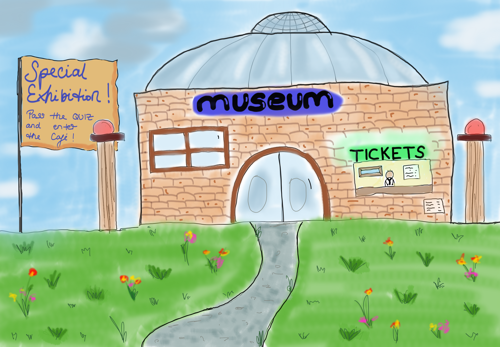

# Celia and Luisas Art Museum

Have you ever wanted to visit an art museum that displays all the most famous paintings for free? 
Come in and explore everything from Da Vincis worldfamous "Mona Lisa" to Vincent van Goghs "Starry Night".
Just align the magnifying glass with the painting and press ENTER.
After the exhibition you'll be able to demonstrate your new knowledge in a quiz. 
As a reward for your efforts you'll get to visit our beautiful cafe afterwards. 
Have fun!



### Installation

This project uses Pygame version 2.6.1 .

```
pip install -r requirements.txt
```

### Usage

First, install all required libraries.
Next, make sure the media and main loop file are located in the same folder. 
Else, the main loop won't be able to locate the media needed for the background, character, ect...
Make sure Pygame works properly with your Python Version (you might need to install an older version of Python: we used Python 3.12 for instance)

```
python art_museum.py
```

### Repository guidance


```
CeliaJonen_LuisaLoddo_Art_Museum/
├── art_museum.py
├── media/
├── LICENSE
├── README.md
├── requirements.txt
└── documentation.md (or documentation.pdf)
```

- `art_museum.py`: main loop of the game
- `media/`: all images for backgrounds, paintings and the players character.
- `LICENSE`: MIT License
- `requirements.txt`: libraries needed for the game
- `documentation.md/pdf`: includes
  - Initial idea (intermediate demo)
  - Development process and challenges
  - Future improvements and known limitations
  - sources for image description
  - work division


